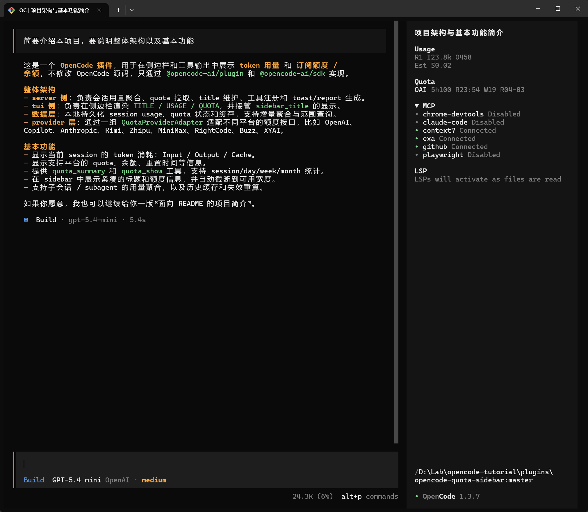

# opencode-quota-sidebar

[](https://www.npmjs.com/package/@leo000001/opencode-quota-sidebar)
[](https://github.com/xihuai18/opencode-quota-sidebar/blob/main/LICENSE)

OpenCode plugin: show token usage and subscription quota in the session sidebar title.



## Install

Add the package name to `plugin` in your `opencode.json`. OpenCode uses Bun to install it automatically on startup:

```json
{
  "plugin": ["@leo000001/opencode-quota-sidebar@2.0.1"]
}
```

Note for OpenCode `>=1.2.15`: TUI settings (`theme`/`keybinds`/`tui`) moved to `tui.json`, but plugin loading still stays in `opencode.json` (`plugin: []`).
This plugin also accepts both `config.providers` and older `provider.list` runtime shapes when discovering provider options.

If you prefer automatic upgrades, you can still use `@latest`, but pinning an exact version makes behavior easier to reproduce when debugging.

## Development (build from source)

```bash
npm install
npm run build
```

Add the built file to your `opencode.json`:

```json
{
  "plugin": ["file:///ABSOLUTE/PATH/opencode-quota-sidebar/dist/index.js"]
}
```

On Windows, use forward slashes: `"file:///D:/Lab/opencode-quota-sidebar/dist/index.js"`

## Supported quota providers

| Provider        | Endpoint                               | Auth                  | Status                                  |
| --------------- | -------------------------------------- | --------------------- | --------------------------------------- |
| OpenAI Codex    | `chatgpt.com/backend-api/wham/usage`   | OAuth (ChatGPT)       | Multi-window (short-term + weekly)      |
| GitHub Copilot  | `api.github.com/copilot_internal/user` | OAuth                 | Monthly quota                           |
| Kimi For Coding | `api.kimi.com/coding/v1/usages`        | API key               | Multi-window subscription (5h + weekly) |
| RightCode       | `www.right.codes/account/summary`      | API key               | Subscription or balance (by prefix)     |
| Buzz            | `buzzai.cc/v1/dashboard/billing/*`     | API key               | Balance only (computed from total-used) |
| Anthropic       | `api.anthropic.com/api/oauth/usage`    | OAuth                 | Multi-window (5h + weekly / plan-based) |
| XYAI Vibe       | `new.xychatai.com/frontend-api/*`      | Login -> session auth | Daily balance quota with reset time     |

Want to add support for another provider (Google Antigravity, Zhipu AI, Firmware AI, etc.)? See [CONTRIBUTING.md](CONTRIBUTING.md).

## Features

- TUI session title uses a compact multiline sidebar layout:
  - line 1: original session title
  - line 2: blank separator
  - line 3: compact usage tokens such as `R3 I16.3k O916`
  - line 4+: compact cache tokens such as `CW300 CR31.4k Cd66%`
  - optional cost line: `Est$0.12`
  - quota lines also use compact tokens, for example `XYAI D$31.3/$90 R22:39` or `OAI 5h80 R22:18 W70 R04-03`
  - short windows (`5h`, `1d`, `Daily`) still show same-day resets as `HH:MM` and cross-day resets as `MM-DD HH:MM`; longer windows continue to show `MM-DD`
  - long quota content wraps across extra compact lines instead of dropping fields from the sidebar, and continuation lines align to the quota content column
- Desktop automatically switches to a compact monitoring-style single-line title. It keeps recently used providers from the last `50` requests or last `60` minutes, expands all windows/balance for those selected providers in short form such as `OAI 5h80 R16:20 W70 R04-03` or `RC D88.9/60 B260`, and keeps only summary usage signals such as `Cd66%` and `Est$0.12`
- Auto mode now prefers compact single-line titles everywhere except the actively selected TUI session. That means Desktop stays compact, Web UI / `serve` clients also use compact single-line titles, and the current TUI session keeps the compact multiline layout.
- `sidebar.titleMode` can force `auto`, `multiline`, or `compact` if the heuristic does not match your workflow.
- Session-scoped usage/quota can include descendant subagent sessions (enabled by default via `sidebar.includeChildren=true`). Traversal is bounded by `childrenMaxDepth` (default 6), `childrenMaxSessions` (default 128), and `childrenConcurrency` (default 5); truncation is logged when `OPENCODE_QUOTA_DEBUG=1`. Day/week/month ranges never merge children — only session scope does.
- Toast message can include four sections: `Token Usage`, `Cost as API` (per provider), `Provider Cache` (when provider-level cached ratios are available), and `Quota`
- Expiry reminders are shown in a separate `Expiry Soon` toast section only for providers with real subscription expiry timestamps, and each session shows that auto-reminder at most once
- `quota_summary` markdown / toast also include `Cached` summary lines when cache activity is available
- Quota snapshots are de-duplicated before rendering to avoid repeated provider lines
- Custom tools:
  - `quota_summary` — generate usage report for session/day/week/month (full markdown report + toast). The markdown report and toast keep the full human-readable wording; they do not switch to compact sidebar tokens.
- `quota_show` — toggle sidebar title display on/off (state persists across sessions)
- After startup, titles are restored immediately when persisted display mode is OFF; when persisted display mode is ON, touched titles refresh on startup and the rest update on the next relevant session/message event or when `quota_show` is toggled
- Quota connectors:
  - OpenAI Codex OAuth (`/backend-api/wham/usage`)
  - GitHub Copilot OAuth (`/copilot_internal/user`)
  - Kimi For Coding API key (`/usages`, built-in `kimi-for-coding` provider)
  - RightCode API key (`/account/summary`)
  - Buzz API key (`/v1/dashboard/billing/subscription` + `/v1/dashboard/billing/usage`)
  - Anthropic Claude OAuth (`/api/oauth/usage`, with beta header)
  - XYAI Vibe account login (`/frontend-api/login` -> cached `share-session` -> `/frontend-api/vibe-code/quota`)
- OpenAI OAuth quota checks auto-refresh expired access token (using refresh token)
- Generic API key providers without quota endpoints still show usage aggregation only; built-in adapters such as Kimi For Coding, RightCode, Buzz, and XYAI Vibe also show quota or balance details.
- Incremental usage aggregation — only processes new messages since last cursor
- Sidebar token units are adaptive (`k`/`m` with one decimal where applicable)

### Kimi For Coding notes

- OpenCode's built-in provider ID is `kimi-for-coding` and its runtime base URL is `https://api.kimi.com/coding/v1`.
- The plugin treats Kimi as a subscription quota source, not a balance source.
- Quota data is read from `GET https://api.kimi.com/coding/v1/usages`.
- The current implementation maps the short rolling window in `limits[]` to `5h` and the top-level `usage` block to `Weekly`.
- Rendering follows the same compact reset formatting as OpenAI: short windows show `Rst MM-DD HH:MM` when they cross days, and longer windows show `Rst MM-DD`.

### XYAI Vibe notes

- Enable it explicitly under `quota.providers.xyai-vibe.enabled`; it is not enabled by default.
- Configure login credentials in `quota-sidebar.config.json`, not in source code.
- The adapter logs in via `POST https://new.xychatai.com/frontend-api/login`, caches the returned `share-session`, and retries quota fetches with that session.
- Quota data is read from `GET https://new.xychatai.com/frontend-api/vibe-code/quota`.
- Compact displays show the daily balance and the true reset time when present; expiry stays as secondary report/toast metadata.

## Storage layout

The plugin stores lightweight global state and date-partitioned session chunks.

- Global metadata: `<opencode-data>/quota-sidebar.state.json`
  - `titleEnabled`
  - `sessionDateMap` (sessionID -> `YYYY-MM-DD`)
  - `quotaCache`
- Session chunks: `<opencode-data>/quota-sidebar-sessions/YYYY/MM/DD.json`
  - per-session title state (`baseTitle`, `lastAppliedTitle`)
  - `createdAt`
  - `parentID` (when the session is a subagent child session)
  - `expiryToastShown` (session-level dedupe for automatic expiry reminders)
  - cached usage summary used by `quota_summary`, including session-level and provider-level `cacheBuckets` for cached-ratio reporting and legacy cache classification
  - incremental aggregation cursor

Notes on cache bucket persistence:

- Older cached usage written before `cacheBuckets` existed can only be approximated from top-level `cache_read` / `cache_write` totals.
- In those legacy cases, mixed read-only + read-write cache traffic may be attributed to a single fallback bucket until the session is recomputed from messages.

Example tree:

```text
~/.local/share/opencode/
  quota-sidebar.state.json
  quota-sidebar-sessions/
    2026/
      02/
        23.json
        24.json
```

Sessions older than `retentionDays` (default 730 days / 2 years) are evicted from
memory on startup. Chunk files remain on disk for historical range scans.

## Compatibility

- Node.js: >= 18 (for `fetch` + `AbortController`)
- OpenCode: plugin SDK `@opencode-ai/plugin` ^1.2.10
- OpenCode config split: if you are on `>=1.2.15`, keep this plugin in `opencode.json` and keep TUI-only keys in `tui.json`.

## Force refresh after npm update

If `npm view @leo000001/opencode-quota-sidebar version` shows a newer version but OpenCode still behaves like an older release, OpenCode/Bun is usually reusing an older installed copy.

Recommended recovery steps:

1. Pin the target plugin version in `opencode.json`.
2. Fully exit OpenCode.
3. Delete any cached installed copies of the plugin.
4. Start OpenCode again so it reinstalls the package.
5. Verify the actual installed `package.json` version under the plugin directory.

Common install/cache locations:

- `~/.cache/opencode/node_modules/@leo000001/opencode-quota-sidebar`
- `~/node_modules/@leo000001/opencode-quota-sidebar`

Windows PowerShell example:

```powershell
Remove-Item -Recurse -Force "$HOME\.cache\opencode\node_modules\@leo000001\opencode-quota-sidebar" -ErrorAction SilentlyContinue
Remove-Item -Recurse -Force "$HOME\node_modules\@leo000001\opencode-quota-sidebar" -ErrorAction SilentlyContinue
```

macOS / Linux example:

```bash
rm -rf ~/.cache/opencode/node_modules/@leo000001/opencode-quota-sidebar
rm -rf ~/node_modules/@leo000001/opencode-quota-sidebar
```

## Optional commands

You can add these command templates in `opencode.json` so you can run `/qday`, `/qweek`, `/qmonth`, `/qtoggle`:

```json
{
  "command": {
    "qday": {
      "description": "Show today's usage and quota",
      "template": "Call tool quota_summary with period=day and toast=true."
    },
    "qweek": {
      "description": "Show this week's usage and quota",
      "template": "Call tool quota_summary with period=week and toast=true."
    },
    "qmonth": {
      "description": "Show this month's usage and quota",
      "template": "Call tool quota_summary with period=month and toast=true."
    },
    "qtoggle": {
      "description": "Toggle sidebar usage display on/off",
      "template": "Call tool quota_show (no arguments, it toggles)."
    }
  }
}
```

When calling `quota_summary`, make sure the client shows the returned markdown report directly to the user. The tool already returns the full report body; do not replace it with a compact summary.

## Configuration files

Recommended global config:

- `~/.config/opencode/quota-sidebar.config.json`

Optional project overrides:

- `<worktree>/quota-sidebar.config.json`
- `<directory>/quota-sidebar.config.json` (when different from `worktree`)
- `<worktree>/.opencode/quota-sidebar.config.json`
- `<directory>/.opencode/quota-sidebar.config.json` (when different from `worktree`)

Optional explicit override:

- `OPENCODE_QUOTA_CONFIG=/absolute/path/to/config.json`

Optional config-home override:

- `OPENCODE_QUOTA_CONFIG_HOME=/absolute/path/to/config-home`

Resolution order (low -> high):

1. Global config (`~/.config/opencode/...`)
2. `<worktree>/quota-sidebar.config.json`
3. `<directory>/quota-sidebar.config.json`
4. `<worktree>/.opencode/quota-sidebar.config.json`
5. `<directory>/.opencode/quota-sidebar.config.json`
6. `OPENCODE_QUOTA_CONFIG`

Values are layered; later sources override earlier ones.

## Configuration

If you do not provide any config file, the plugin uses the built-in defaults below.

### Built-in defaults

Sidebar defaults:

- `sidebar.enabled`: `true`
- `sidebar.width`: `36` (clamped to `20`-`60`)
- `sidebar.titleMode`: `auto` (`auto`/`multiline`/`compact`)
- `sidebar.multilineTitle`: `true` (legacy compatibility field; title style is now chosen automatically)
- `sidebar.showCost`: `true`
- `sidebar.showQuota`: `true`
- `sidebar.wrapQuotaLines`: `true`
- `sidebar.includeChildren`: `true`
- `sidebar.childrenMaxDepth`: `6` (clamped to `1`-`32`)
- `sidebar.childrenMaxSessions`: `128` (clamped to `0`-`2000`)
- `sidebar.childrenConcurrency`: `5` (clamped to `1`-`10`)
- `sidebar.desktopCompact.recentRequests`: `50` (compact single-line titles)
- `sidebar.desktopCompact.recentMinutes`: `60` (compact single-line titles)

Quota defaults:

- `quota.refreshMs`: `300000` (clamped to `>=30000`)
- `quota.includeOpenAI`: `true`
- `quota.includeCopilot`: `true`
- `quota.includeAnthropic`: `true`
- `quota.providers`: `{}` (per-adapter switches and adapter-specific config, for example `rightcode.enabled` or `xyai-vibe.login.username/password`)
- `quota.refreshAccessToken`: `false`
- `quota.requestTimeoutMs`: `8000` (clamped to `>=1000`)

Other defaults:

- `toast.durationMs`: `12000` (clamped to `>=1000`)
- `retentionDays`: `730`

### Full example config

```json
{
  "sidebar": {
    "enabled": true,
    "width": 36,
    "titleMode": "auto",
    "multilineTitle": true,
    "showCost": true,
    "showQuota": true,
    "wrapQuotaLines": true,
    "includeChildren": true,
    "childrenMaxDepth": 6,
    "childrenMaxSessions": 128,
    "childrenConcurrency": 5,
    "desktopCompact": {
      "recentRequests": 50,
      "recentMinutes": 60
    }
  },
  "quota": {
    "refreshMs": 300000,
    "includeOpenAI": true,
    "includeCopilot": true,
    "includeAnthropic": true,
    "providers": {
      "buzz": {
        "enabled": true
      },
      "rightcode": {
        "enabled": true
      }
    },
    "refreshAccessToken": false,
    "requestTimeoutMs": 8000
  },
  "toast": {
    "durationMs": 12000
  },
  "retentionDays": 730
}
```

### Notes

- `sidebar.showCost` controls API-cost visibility in sidebar title, `quota_summary` markdown report, and toast message.
- `quota_summary` follows the same reset compaction rules for short windows in its subscription section (`5h` / `1d` / `Daily` show time, long windows show date, RightCode `Exp` stays date-only).
- `sidebar.width` is measured in terminal cells. CJK/emoji truncation is best-effort to avoid sidebar overflow.
- `sidebar.titleMode` defaults to `auto`: Desktop is compact, the actively selected TUI session stays multiline, and everything else (including Web UI / `serve` clients) uses the compact single-line layout. Use `multiline` or `compact` to force one style.
- `auto` relies on positive TUI signals (`tui.session.select`, plus recent `tui.command.execute` / `tui.prompt.append` activity to keep that selection fresh). If your setup still picks the wrong style, force it with `sidebar.titleMode`.
- `sidebar.multilineTitle` is kept for backward compatibility, but `sidebar.titleMode` now controls the active policy.
- `sidebar.wrapQuotaLines` controls quota line wrapping and continuation indentation (default: `true`).
- `sidebar.includeChildren` controls whether session-scoped usage/quota includes descendant subagent sessions (default: `true`).
- `sidebar.childrenMaxDepth` limits how many levels of nested subagents are traversed (default: `6`, clamped 1–32).
- `sidebar.childrenMaxSessions` caps the total number of descendant sessions aggregated (default: `128`, clamped 0–2000).
- `sidebar.childrenConcurrency` controls parallel fetches for descendant session messages (default: `5`, clamped 1–10).
- `sidebar.desktopCompact.recentRequests` and `sidebar.desktopCompact.recentMinutes` control which recently used providers remain visible in compact single-line titles.
- `output` includes reasoning tokens (`output = tokens.output + tokens.reasoning`). Reasoning is not rendered as a separate line.
- API cost bills reasoning tokens at the output rate (same as completion tokens).
- API cost is computed from OpenCode model pricing metadata, not from `message.cost`. This keeps subscription-backed providers such as OpenAI OAuth usable for API-equivalent cost estimation even when OpenCode's measured cost is `0`.
- When OpenCode exposes a long-context tier like `context_over_200k`, the plugin uses that premium rate for the whole request once `input > 200000`, matching OpenCode's current pricing schema.
- `quota.providers` is the extensible per-adapter switch map.
- If API Cost is `$0.00`, it usually means the model/provider has no pricing mapping in OpenCode at the moment, so equivalent API cost cannot be estimated.
- Usage chunks cache both measured `cost` and computed `apiCost`. `quota_summary` (`/qday`, `/qweek`, `/qmonth`) recomputes range totals from session messages so period filtering follows message completion time; refreshed full-session usage may then be persisted back into day chunks when billing-cache refresh is needed.

### Buzz provider example

Buzz matching is based on the provider `baseURL`, similar to RightCode. Any OpenAI-compatible provider that points at `https://buzzai.cc` will be recognized by the Buzz adapter and rendered as a balance-only quota source.

Provider options example:

```json
{
  "id": "openai",
  "options": {
    "baseURL": "https://buzzai.cc",
    "apiKey": "sk-..."
  }
}
```

The adapter also tolerates `https://buzzai.cc/v1`, but `https://buzzai.cc` is the recommended example.

With that setup, the sidebar/toast quota line will look like:

```text
Buzz B￥10.17
```

## Rendering examples

These examples show the quota block portion of the sidebar title.

### TUI layout

This section describes the multiline TUI layout. Desktop and Web UI / `serve` clients use the compact single-line format unless you force `sidebar.titleMode = "multiline"`.

0 providers (no quota data):

```text
(no quota block)
```

1 provider, 1 window (fits):

```text
Cop M78 R04-01
```

1 provider, multi-window (for example OpenAI 5h + Weekly):

```text
OAI 5h78 R05:05 W73 R03-12
```

1 provider, multi-window on narrow width:

```text
OAI 5h78 R05:05
    W73 R03-12
```

1 provider, short window crossing into the next day:

```text
Ant 5h0 R03-10 01:00 W46 R03-15
```

2+ providers (even if each provider is single-window):

```text
OAI 5h78 R05:05
Cop M78 R04-01
```

2+ providers mixed (multi-window + single-window):

```text
OAI 5h78 R05:05 W73 R03-12
Cop M78 R04-01
```

2+ providers mixed (window providers + Buzz balance):

```text
OAI 5h78 R05:05
Cop M78 R04-01
Buzz B￥10.2
```

Balance-style quota:

```text
RC B260
```

Buzz balance quota:

```text
Buzz B￥10.17
```

Multi-detail quota (window + balance):

```text
RC D$88.9/$60 E02-27 B260
```

Provider status / quota (examples):

```text
Ant 5h80
Cop unavailable
OAI ?
```

### Desktop compact mode

Desktop always uses a compact monitoring-style single-line title. Recently used providers are selected from the last `50` assistant requests or last `60` minutes, and each selected provider expands all of its windows and balances in shorthand. To survive upstream Desktop truncation better, quota segments are emitted before usage summary signals:

```text
<base> | OAI 5h80 R16:20 W70 R04-03 | Cop M78 R04-01 | RC D88.9/60 B260 | Buzz B￥10.2 | Cd66% | Est$0.12
```

Shorthand rules:

- `5h80` = `5h 80%`
- `W70` / `M78` / `D46` = weekly / monthly / daily window remaining percent
- `R16:20` / `R04-03` = reset time/date for that quota window
- `D88.9/60` = daily remaining / daily total
- `B260` / `B￥10.2` = balance
- `Cd66%` = cached ratio (`cache.read / (input + cache.read)`)
- `Est$0.12` = equivalent API cost estimate
- Desktop omits `R/I/O/CR/CW`; TUI keeps the full compact multiline breakdown.
- Order is `base | quota... | usage-summary`, while TUI keeps its multiline usage-first layout.

`quota_summary` also supports an optional `includeChildren` flag (only effective for `period=session`) to override the config per call. For `day`/`week`/`month` periods, children are never merged — each session is counted independently.

## Billing cache behavior

- Cached per-session usage stores token totals, measured `cost`, computed `apiCost`, provider breakdowns, and the incremental cursor.
- Session-scoped sidebar aggregation can merge descendant subagents when `sidebar.includeChildren=true` (default). Measured `cost` stays aligned with the root session's OpenCode `message.cost`, while API-equivalent cost still includes descendant usage.
- Range tools such as `/qday`, `/qweek`, and `/qmonth` do not merge children. They aggregate each session independently across the selected time window.
- When API-cost logic changes, the plugin bumps an internal billing-cache version so historical range reports are recomputed with the new rules the next time they are queried.

## Debug logging

Set `OPENCODE_QUOTA_DEBUG=1` to enable debug logging to stderr. This logs:

- Chunk I/O operations
- Auth refresh attempts and failures
- Session eviction counts
- Symlink write refusals

## Security & privacy notes

- The plugin reads OpenCode credentials from `<opencode-data>/auth.json`.
- If enabled, quota checks call external endpoints:
  - OpenAI Codex: `https://chatgpt.com/backend-api/wham/usage`
  - GitHub Copilot: `https://api.github.com/copilot_internal/user`
  - Kimi For Coding: `https://api.kimi.com/coding/v1/usages`
  - RightCode: `https://www.right.codes/account/summary`
  - Buzz: `https://buzzai.cc/v1/dashboard/billing/subscription` and `https://buzzai.cc/v1/dashboard/billing/usage`
  - Anthropic: `https://api.anthropic.com/api/oauth/usage`
- **Screen-sharing warning**: Session titles and toasts surface usage/quota
  information. If you are screen-sharing or recording, consider toggling the
  sidebar display off (`/qtoggle` or `quota_show` tool) to avoid leaking
  subscription details.
- State is persisted under `<opencode-data>/quota-sidebar.state.json` and
  `<opencode-data>/quota-sidebar-sessions/` (see Storage layout).
- OpenAI OAuth token refresh is disabled by default; set
  `quota.refreshAccessToken=true` if you want the plugin to refresh access
  tokens when expired.
- Anthropic quota currently uses a beta/internal-style OAuth usage endpoint and
  request header; response fields may change without notice.
- Kimi For Coding quota uses the current `/usages` response shape exposed by the Kimi coding service; if Kimi changes that payload, window parsing may need to be updated.
- State/chunk file writes refuse to write through symlinked targets (best-effort defense-in-depth).
- The `OPENCODE_QUOTA_DATA_HOME` env var overrides the OpenCode data directory
  path (for testing); do not set this in production.
- The `OPENCODE_QUOTA_CONFIG_HOME` env var overrides global config directory
  lookup (`<config-home>/opencode`).
- The `OPENCODE_QUOTA_CONFIG` env var points to an explicit config file and
  applies as the highest-priority override.

## Contributing

Contributions are welcome — especially new quota provider connectors. See [CONTRIBUTING.md](CONTRIBUTING.md) for a step-by-step guide on adding support for a new provider.

## License

MIT. See `LICENSE`.
